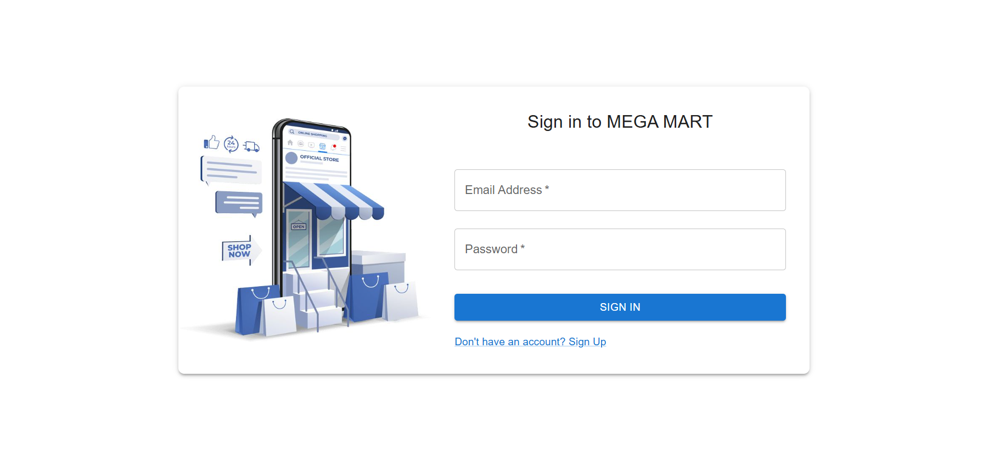
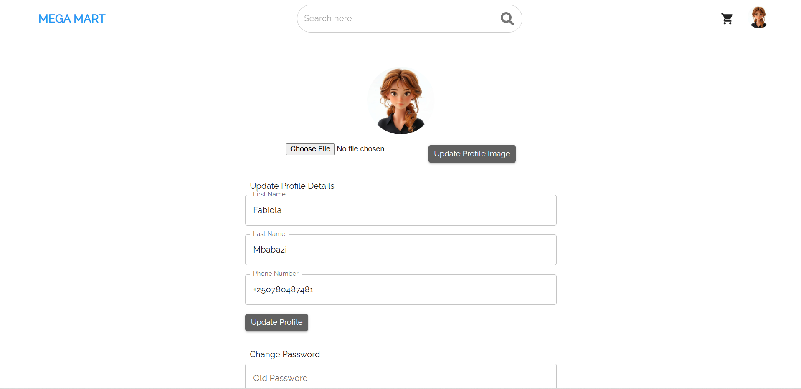
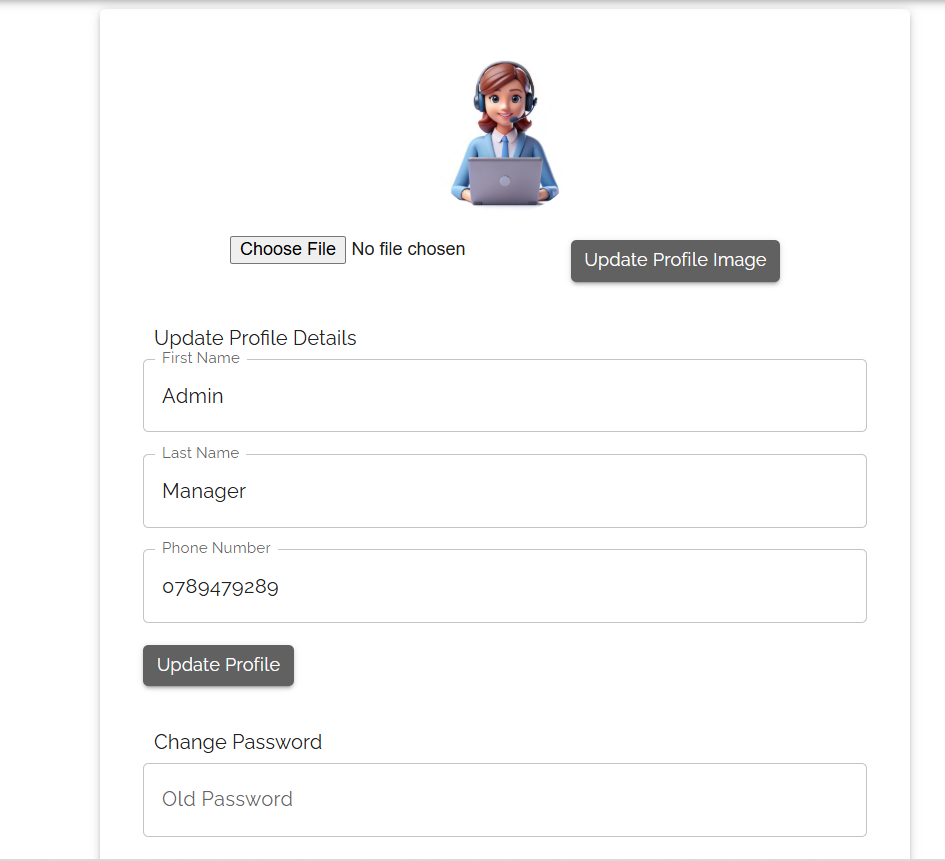
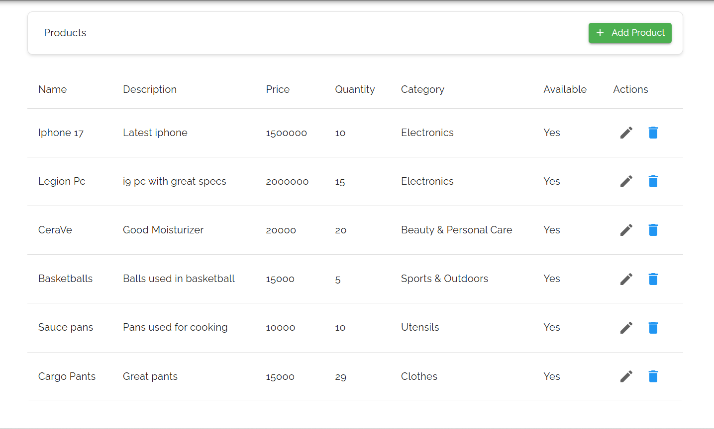
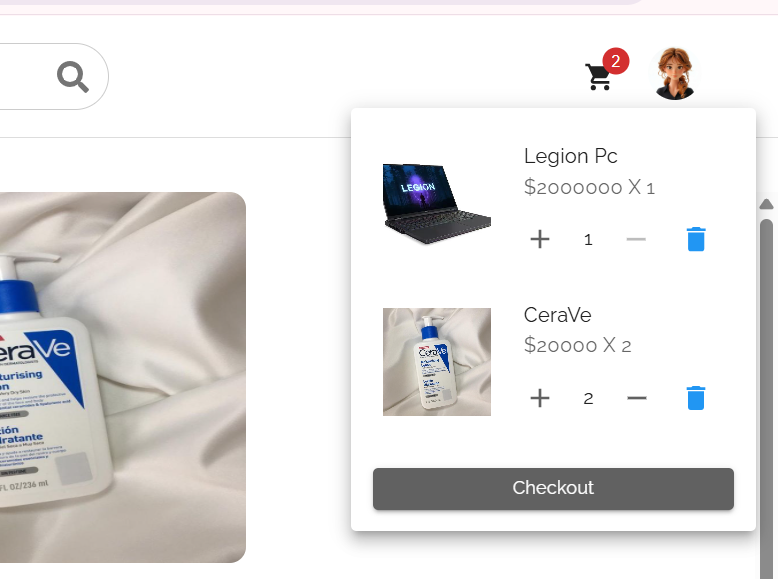
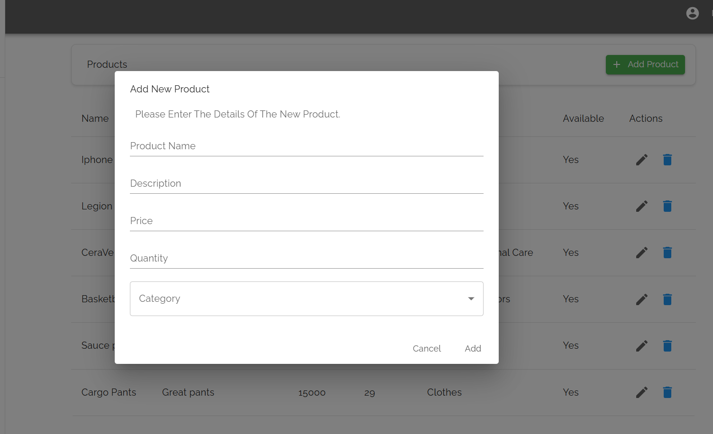
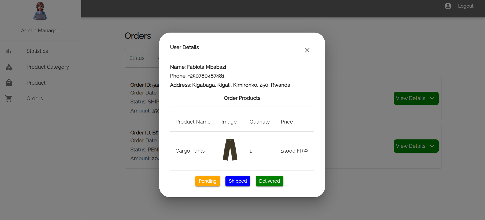

# 🛒 WebTek E-Commerce Platform

A full-stack e-commerce platform enabling customers to browse, purchase, and track products, and admins to manage categories, products, and orders.

---

## 📌 Problem Statement

This project solves the problem of fragmented online transactions by providing a complete shopping experience:

- Admins manage categories, products, and user orders.
- Customers browse, add to cart, check out, and track orders.

---

## ✅ Business Requirements

### 🔒 User Features

- User registration, login, and logout.
- Product browsing by category.
- Shopping cart management.
- Order history and tracking.
- Secure checkout process.

### 🛠️ Admin Features

- Category and product CRUD operations.
- Order approval and status updates.
- Dashboard-level control over users and inventory.

---

## 🧩 Software Qualities

- **Usability**: Clean UI for users and admins.
- **Scalability**: Designed to support growing user and product data.
- **Security**: Token-based auth, encrypted data.
- **Reliability**: Order updates are consistent and always available.
- **Performance**: Fast response with efficient DB queries.

---

## 🧠 Conceptual Model

- **User**: Admin or Customer
- **Product**: Belongs to one category
- **Category**: Groups multiple products
- **Cart**: Temporary storage of selected products
- **Order**: Finalized list of items, tracks delivery status
- **Payment**: Tied to orders

---

## 🏗️ Technical Domain Model

- Admins → Create/edit/delete → Categories & Products  
- Users → Add to cart → Checkout → Order → Payment  
- Orders → Have status: `Pending`, `Shipped`, `Delivered`

---

## 🛢️ Database Schema

### Tables:

- `Users`: Holds user details and roles.
- `Categories`: Product groupings.
- `Products`: Items available for sale.
- `Cart` & `Cart_Items`: Handle temporary selections.
- `Orders` & `Order_Products`: Finalized purchases.
- `User_address`, `Token`, `Password_reset_tokens`, `Product_images`

### Entity Relationships:

- A user → multiple orders  
- A category → multiple products  
- A cart → many cart items  
- An order → many ordered products

---

## 🔐 Authentication & Security

- Secure login using token-based authentication.
- Passwords hashed and stored securely.
- Session management using logout tokens.

---

## 🌟 Key Features with Screenshots

### 🔐 Login Functionality

Users sign in securely using their credentials. This screen separates customers from admin users with role-based access.

---

### ⚙️ User Settings

Users can update their profile details like name, email, and default shipping address to personalize their experience.

---

### 🧍 Admin Settings

Admins can manage their own login credentials and other backend settings.

---

### 🛍️ Product Browsing

Products are listed by category. Users can view product names, prices, descriptions, and availability.

---

### 🛒 Shopping Cart

Users can add products to their cart, adjust quantities, or remove items before proceeding to checkout.

---

### 📦 Checkout Process

The two-step checkout process allows users to enter payment and shipping information, then confirm their order.

  

---

### 🧾 Order Management

Customers can track the status of their orders: *Pending*, *Shipped*, or *Delivered*.

---

### 🗂️ Admin Product & Category Management

Admins can add, edit, or delete product listings and organize them by category using a simple modal form.

---

### 📈 Admin Order Status Updates

Admins can manage and update the status of each order for improved customer communication.

---

## 📈 Future Enhancements

- Payment gateway integration (e.g., Stripe or PayPal)
- Inventory threshold alerts for admins
- Email notifications for order events
- Search and filter options for users

---

## 🧪 Project Structure

